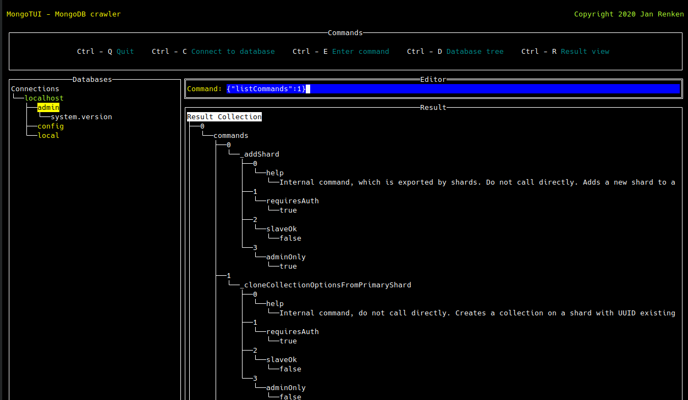

# MongoTUI - MongoDB TUI client

[](https://dev.azure.com/janrenken/MongoTui/_build/latest?definitionId=3&branchName=main)
[](https://goreportcard.com/report/github.com/renkman/mongotui)
[](https://github.com/lachsfilet/Renkbench/blob/master/LICENSE)



[MongoDB](https://www.mongodb.com/ "MongoDB") TUI client written in [Go](https://golang.org/ "Go"), using the [tview](https://github.com/rivo/tview/ "tview") library for UI, [Keyring](https://github.com/99designs/keyring) for storing connections and the [MongoDB Go Driver](https://github.com/mongodb/mongo-go-driver/ "MongoDB Go Driver").

The unit tests are using [Testify](https://github.com/stretchr/testify "Testify").

MongoTUI allows to connect to multiple MongoDB instances and execute commands in JSON syntax on them.

## Features

- Tree view of the connected instance, its databases and collections
- Command execution
- Result tree view

## Installation

Just download a release and copy the mongotui binary to your favorite destination.

## Instruction manual

To start MongoTUI just run mongotui without arguments.

You can run mongotui with the -c argument specifying a MongoDB connection URI to directly connect to a database, for example:

```
mongotui -c mongodb://localhost
```

Press `<Ctrl>`-`<c>` to connect to a MongoDB instance, you can enter the connection parameters individually or the connection URI as well. Notice that the connection URI always wins, if the individual fields and the connection URI are filled.

The open database connections, accessed by `<Ctrl>`-`<d>`, their databases and collections are displayed as a tree view in the left application panel. You can navigate through the nodes with the arrow keys or left-click on them.

The command editor is accessible by `<Ctrl>`-`<e>`. The commands are fired on the database which are selected in the tree view by pressing `<Enter>` or `<Return>` in the command editor.

The command result is shown in the result panel as a tree view. You can access it with `<Ctrl>`-`<r>` and navigate through the nodes with the arrow keys.

`<Ctrl>`-`<t>` disconnects (terminates) the selected connection.

`<Ctrl>`-`<q>` disconnects the open connections and quits the application.
