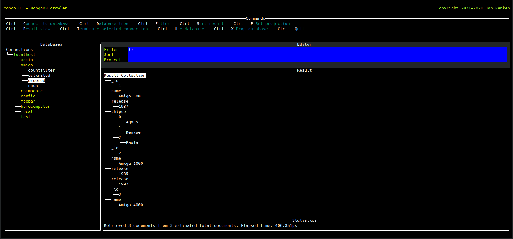

# MongoTUI - MongoDB TUI client

[MongoDB](https://www.mongodb.com/ "MongoDB") TUI client written in [Go](https://golang.org/ "Go"), using the [tview](https://github.com/rivo/tview/ "tview") library and the [MongoDB Go Driver](https://github.com/mongodb/mongo-go-driver/ "MongoDB Go Driver").

## Features

- Tree view of the connected client, its databases and collections
- Command execution
- Result tree view